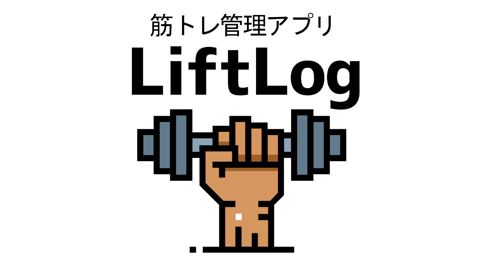

  

# LiftLog - シンプルで継続しやすい筋トレ管理アプリ

LiftLogは、日々のトレーニングを素早く記録し、総重量推移のグラフや自己ベストなどのレポート機能を通して成長を可視化できる筋トレ管理アプリです。

「記録の手間を最小限にし、継続しやすいこと」を重視し、シンプルな操作やAjax通信などを中心としたUI/UX設計を行いました。

主にスマートフォンでの利用を前提に開発しています。

---

## 本番環境
🔗 https://liftlog-app.com

---

## Qiita記事
[【ポートフォリオ】筋トレ管理アプリ「LiftLog」を開発しました（Ruby x Rails x Hotwire）](https://qiita.com/yamu618/items/fb6239045855150a6c7c)

### 想定しているユーザー
| ユーザー層 | 特徴 |
|------------|------|
| 初心者〜中級者トレーニー | 記録を手軽に行い、継続のためにモチベーションを保ちたい |
| 忙しい社会人・学生 | すきま時間でサッと記録したい |

### なぜこのアプリケーションを作ったか？
ポートフォリオを制作するにあたり、自分自身が継続して使い続けられ、最も利用頻度の高いユーザーになれるアプリを作りたいと考えました。

私は週に3〜5日ジムで筋トレを行っており、筋トレ管理アプリであれば、転職活動後も継続して開発・改善に取り組むモチベーションを維持できると考えました。また、自分自身が日常的に使うユーザーになることで、実体験に基づいたユーザー目線での機能改善やUI/UX設計ができる点にも魅力を感じました。

以上の理由から、ポートフォリオとして技術力をアピールできることに加え、今後も運用・改善を続けていける題材として、筋トレ管理アプリを選択しました。

アプリケーションとしては自分の考える機能が整ったためリリースしましたが、今後様々な機能を追加していきたいと思っております。

## 実装機能一覧
現在リリースしているアプリの機能一覧です。
それぞれの機能について簡単に紹介します。
- ユーザー管理
- 固定カテゴリー
- 種目管理
- オートコンプリート
- ワークアウト管理
- 直近記録のコピー
- カレンダー
- 筋トレレポート
- ポップアップメッセージ
- 管理ページ
- お問い合わせ
- バリデーション
- UI 最適化
- CI
- OGP・ファビコン

### ユーザー管理
Deviseを使用し、基本的なユーザー機能(ユーザー登録、ログイン、ユーザー削除、プロフィール編集)を実装しました。また、ユーザーが手軽に登録・ログインが行えるよう、OAuthを使用してGoogleログイン機能を追加しました。

  
  
  

Stimulusを使用して、パスワード入力の表示・非表示切替機能を実装しました。

パスワードリセットも実装済みです。

  

### 固定カテゴリー、種目管理
部位の固定カテゴリーとして、胸・肩・腕・背中・脚・腹・有酸素を用意しました。また、カテゴリータブの切替はturbo frameを使用して、非同期通信化しています。

種目は、カテゴリーごとに自由に追加・編集・削除が行えます。種目編集や種目削除はTurboを使用して非同期通信化しています。
- 種目追加
    
- 種目編集（インライン編集）
 
- 種目削除
 　

### オートコンプリート
 同じ種目でもダンベル/バーベル/マシンなどで、別々に記録管理したい方を想定し、種目追加フォームにオートコンプリート機能を実装しました。これにより、種目追加の際の負担を軽減しています。

### ワークアウト、セット管理
筋トレ管理アプリの肝になる部分なので、一番時間をかけて開発しました。

ワークアウトは日付、カテゴリー、種目を選んで登録できます。

セットは登録したワークアウトに紐づける形で管理することができます。
セット追加はstimulusを使用して、フォームの動的操作（追加・削除）を実装しました。

セット編集はturbo streamを使用して、非同期通信のインライン編集を実装しました。

セット削除もturbo streamを使用して、非同期通信を実装しています。

### 直近記録のコピー
LiftLogの独自機能の一つとして、直近のワークアウトに登録されたセット記録を、ワンタップでコピーする機能を実装しました。
これにより、前回行った重量や回数を思い出す手間をなくし、トレーニングをする際の負担を削減することを意図しています。

### カレンダー
simple calendarを使用して、TOPページにカレンダーを表示しました。

記録がある日には印が付くようになっており、ぱっと見るだけでその月にどのくらいトレーニングを行ったかを確認することが出来ます。

また、今日ボタンを配置することで過去記録を閲覧した後の手間を削減しています。

カレンダーに関する操作（月の切替/今日ボタン/日付クリックなど）はturbo frameを使用して、すべて非同期通信化しています。

### レポート機能
ユーザーがセットを登録すると、自動でトレーニング日数・月ごとの総重量推移・自己ベストが計算され、レポートページで閲覧できます。

トレーニング日数は総トレーニング日数・今月,今週のトレーニング日数が記録されます。さらに、前月,前週との比較も自動で計算されるようになっています。

月ごとの総重量推移は、ChartkickとGroupdateを使用し、グラフ表示を実装しました。

自己ベストはシンプルに最高重量が表示されるようになっています。

### ポップアップメッセージ
自己ベスト更新時・トレーニング日数が一定に達したときにポップアップメッセージが表示されます。

- 自己ベスト更新時

- トレーニング日数が一定に達したとき

### 管理ページ
rails_adminを利用して管理ページを実装しました。主にユーザーの管理、お問い合わせの内容確認に使用しています。

管理者ユーザーはヘッダーに管理者ログインボタンが配置され、管理ページに接続できるようになっています。

また、管理者権限を持たないユーザーが管理ページに接続したときは、エラーが発生し接続できない仕様です。

  

### お問い合わせ
ユーザーからのご意見・ご要望・不具合報告などの連絡手段として、お問い合わせページを実装しました。

  

### バリデーション
意図しないDBへのデータ入力を防ぐために、モデルにバリデーションを設定し、誤った操作や入力がなされた場合にバリデーションエラーが発生するようにしています。
参考↓

### UI/UX 最適化
Hotwire（turbo/stimulus）を使用して、非同期通信や動的操作を実装し、ユーザーの操作負担を軽減しました。

また、Bootstrap5を使用してシンプルで整ったUIを表現しました。

### CI
GitHub Actionsでプルリクエスト時にrubocopやrspecなどの自動テストが実行されるよう実装しました。

### OGP・ファビコン
SNS共有時の見た目を最適化するために、静的OGPを設定しました。

ブラウザのタブやブックマークバーで、どのサイトか瞬時にわかるようにするため、ファビコンを設定しました。

## 開発スケジュール
プログラミング学習は2025年9月から開始しました。

1か月半ほど基礎技術の学習を行った後、10月中旬からアプリケーション開発を開始しました。

アイデア出しから MVPリリースまでに1か月、その後、機能追加・改善を行い 本リリースまでにさらに1か月をかけ、合計約2か月間 で開発を行いました。

## ポートフォリオに使用した技術
**バックエンド - Ruby, Ruby on Rails**

Rubyを採用した理由は、シンプルで直感的な構文を持つことに加え、MVCフレームワークとしてRuby on Railsを使用したかったからです。

また、下記のようなWeb教材や参考書などの王道教材がそろっており、より学習や情報収集がしやすいと考えました。

   　・ Ruby on Rails ガイド
   　・ Ruby on Rails チュートリアル
   　・ プロを目指す人のためのRuby入門
   　・ パーフェクトRuby on Rails

**フロントエンド - Hotwire(turbo/stimulus)**

Hotwireを採用した理由は、学習コストを抑えてサーバーサイドの開発に集中しながら、Railsアプリに段階的にSPA風の挙動を追加できる点に魅力を感じたからです。

HotwireはRails 7以降でフロントエンドのデフォルト技術として採用されており、Railsのエコシステムとして高い親和性を持っています。そのため、新たなフロントエンドフレームワークを導入することなく、比較的少ない実装コストで非同期通信や動的UIといったSPAのメリットを享受できます。

この特性は、「できるだけ早くポートフォリオを完成させ、転職活動を開始したい」という自身の目的と合致していたため、Hotwireを採用しました。

**インフラ, その他 - Render, PostgreSQL, Docker, GitHub**

##### Render
無料利用枠のあるPaaSを調査した結果、近年利用者が増えているRenderを採用しました。
Railsアプリを比較的簡単にデプロイでき、個人開発でも扱いやすい点に魅力を感じました。

一方で、Renderの無料プランには以下の制約がありました。

- 15分間非アクティブ状態が続くとサーバーがスリープする
- データベースは、作成から30日後に自動停止し、14日間の猶予期間後にデータごと削除される

これらの制約に対して、
① サーバースリープ対策として Google Apps Script を用いて10分おきに定期アクセス
② データベースの永続化対策として 外部のPostgreSQLサービスであるNeonを利用
という形で対応しました。

無料枠の制約を理解した上で運用面の工夫を行い、安定して利用できる構成を意識しました。

##### PostgreSQL
開発初期からRenderでのデプロイを想定していたため、Renderが標準でサポートしているPostgreSQLを採用しました。

これにより、開発環境と本番環境の差異を最小限に抑え、環境差によるトラブルを回避できると考えました。

また、本番環境では 無料プランに期限がなく、サーバーレスで利用可能なNeonを使用しています。

##### Docker
開発環境と本番環境の差分をなくすこと、またローカル開発環境の構築をスムーズに行うことを目的としてDockerを採用しました。

環境構築にかかる手間を減らし、開発に集中できる状態を整えています。

##### GitHub
ソースコード管理にGitHubを使用しています。
また、GitHub Actionsを利用して、プルリクエスト作成時にRSpecやRuboCopが自動実行されるCI環境を構築しました。

これにより、機能追加や修正時にも品質を保ちながら開発を進められるよう意識しています。

## 設計、デザイン
**ER図**

**デザイン**
デザインのコンセプトを明確にするために、Figmaを活用してデザインのイメージを作成しました。

## 工夫した点
#### ユーザーの課題を解決する機能設計

アプリケーション開発において最も重要なのは、ユーザーが日常的に感じている課題を解決することだと考えました。
私自身が筋トレを継続する中で
- 記録が面倒
- 過去の成長が分かりにくい

という課題を感じていたため、ワンタップで直近のセット記録をコピーできる機能や、複数のレポート機能を実装しました。

単にポートフォリオを作るのではなく、「自分が毎日使い続けられるか」を基準に、ユーザー目線での開発を意識しました。
 
#### Turboを活用した非同期処理によるUX改善

LiftLogでは、カレンダー切替やカテゴリ切替、インライン編集など表示を切り替える操作が多く、ページリロードが頻発するとユーザーのストレスになると考えました。

そこでTurbo FrameやTurbo Streamを活用し、Ajax通信による非同期処理を実装しました。

ページ全体のリロードを極力なくすことで、操作感を向上させ、継続して使いやすいUXを実現できたと感じています。

#### テスト実装とCIによる品質担保
RSpecによるモデルスペック・システムスペックを実装し、機能修正や追加時に既存機能へ影響がないかを確認する開発フローを意識しました。

また、Rubocopを導入してコード規約を統一し、可読性と保守性の向上を図りました。

さらに、GitHub ActionsでCIを構築し、プルリクエスト時に自動でテストが実行される環境を整えたことで、チーム開発を想定した品質担保の重要性を学びました。

 ## アプリケーションの今後の予定
 今回、**LiftLog**をリリースしましたが、実際にユーザーに継続して使っていただくには、まだまだ機能不足だと認識しています。
 
 そのため、今後は以下の様な機能を実装していきたいと考えています。
 - ワークアウトごとにメモをつけられる機能
 - ユーザープロフィールの充実（アイコン、身長、体重など）
 - レポート機能の充実（体重推移や1RM推移グラフの追加）
 - ゲーム的な要素として実績バッジが得られる機能
 - 月ごとに体の写真を登録し、成長記録として閲覧できる機能
 - 記録した部位ごとにカレンダーの印の色が変わる機能

## ポートフォリオ制作を終えて
### 感想
今回のポートフォリオ制作を通して、初めて自分が開発したWebアプリケーションをリリースしました。

技術を活用して何かを形にしたり、試行錯誤しながら課題を解決していく過程は非常に楽しく、エンジニアとしてのものづくりの魅力を強く実感しました。

実装した機能自体は決して高度なものではありませんが、モデルやデータ構造を自分で設計し、それをもとに処理の流れやロジックを考えて実装した経験は、大きな学びになりました。

開発中は多くの課題に直面しましたが、その都度仮説を立てて検証したり、エラーログを調査したり、データの受け渡しの流れを追うことで原因を特定するなど、問題解決に向き合う姿勢と手法を身につけることができたと感じています。

開発を始める前は「本当に完成させられるのか」と不安もありましたが、実際に手を動かしてみることで徐々に実装が進み、実践を通じて学ぶことの大切さを改めて実感しました。

今回の経験を活かし、今後もより良い設計や実装を意識しながら開発に取り組んでいきたいと考えています。

### 反省点
**1. CIの導入が遅かったこと**

本アプリケーションでは、GitHub ActionsによるCIを開発終盤に導入しました。そのため、開発初期段階ではテストの自動実行が十分に活用できていなかったと感じています。

今後は、開発初期からCIを導入し、実装と同時にテスト・品質担保を行う開発フローを意識したいと考えています。

**2. ユーザーヒアリングの幅が限られていたこと**

今回のポートフォリオ制作では、主に私自身とトレーニー仲間数名からの意見をもとに企画・機能設計を行いました。そのため、ユーザー層が限定され、設計や機能に主観が入りやすい部分があったと感じています。

今後はSNSなどを活用してより多くのユーザーから意見を収集し、仮説検証を繰り返しながら、よりユーザー視点を意識したプロダクト改善に取り組んでいきたいと考えています。

## 今後取り組みたいこと
今後は、LiftLogを題材にしながら、より実践的な開発スキルを身につけるため、以下の取り組みを進めていきたいと考えています。

- LiftLogのネイティブアプリ化
Webアプリケーションとして開発したLiftLogを、Android向けのネイティブアプリとしても展開できるよう、現在KotlinおよびAndroid Studioのキャッチアップを進めています。
モバイルアプリ開発を通じて、端末特有のUXや設計への理解を深めたいと考えています。
- モダンフロントエンドの導入
VueやReact、Tailwind CSSなどを導入し、フロントエンドとバックエンドの役割分担をより明確にした構成に挑戦したいと考えています。
- デプロイ自動化（CDの導入）
現在はCIのみ導入しているため、今後はCDも含めた自動デプロイ環境を構築し、開発からリリースまでの流れを一貫して自動化したいと考えています。
- 何かしらのAPI連携を活用した機能の導入
外部APIとの連携を通じて、非同期処理やデータ連携の理解を深めるとともに、アプリケーションとしての価値を高める機能を実装したいと考えています。

エンジニアとして活躍していくためには、日々のスキルアップは欠かせないと思いますので、これからもいろんな技術に触れて総合力の高いエンジニアを目指していこうと思います。

## 最後に
最後までご覧いただき、ありがとうございます。

本ポートフォリオは、初学者なりに試行錯誤を重ねながら設計・実装を行いました。

至らない点や改善の余地は多くあると考えておりますが、ご意見やご指摘は今後の学習・開発に積極的に活かしていきたいと考えていますので、ぜひ率直なフィードバックをいただけますと幸いです。
